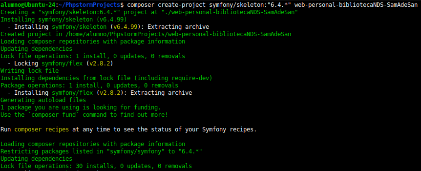
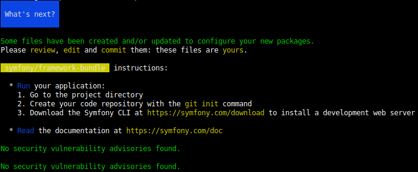

# Mi web del apartado de `symphony-contactos`: Biblioteca de juegos de NDS
¡Hola y bienvenido a mi biblioteca de juegos de Nintendo DS! En esta web encontrarás una enciclopedia de mis juegos favoritos de la clásica NDS. ¡Explora y revive la nostalgia de los juegos de Nintendo DS conmigo!

---
- **Autor**: Samuel Aded
- **Profesor**: Víctor Ponz
- **Curso**: 2º CFGS de DAW (DWES - symphony_contactos)
---
## 1. Comandos a utilizar
### 1.1. Instalación de las carpetas `/var` y `/vendor` (*composer*)
Luego tenemos que instalar composer ejecutando este comando:
```bash
  composer create-project symfony/skeleton:"6.4.*" web-personal-bibliotecaNDS-SamAdeSan
```
El comando anterior creará la carpeta del proyecto con el nombre `web-personal-bibliotecaNDS-SamAdeSan`.

**¡OJO CON ESTO!**: El comando no funciona si la carpeta ya existe o tiene contenido dentro. 
Lo que puedes hacer si ya tienes la carpeta creada es borrarla, moverla a otro sitio y copiar después su contenido o crear el proyecto en otra carpeta diferente.

Tras la ejecución del comando anterior, te mostrará algo así:




Después de crear el proyecto, tenemos que entrar en la carpeta del proyecto:
```bash
  cd web-personal-bibliotecaNDS-SamAdeSan
```
Y para instalar las carpetas `/var` y `/vendor` que contienen las dependencias necesarias para que el proyecto funcione, ejecutamos:
```bash  
  composer install
```
El comando anterior lo necesitarás cada vez que clones un proyecto de symphony desde GitHub u otra plataforma.

---
### 1.2. Comandos necesarios para la gestión y la creación de entidades y controladores.
1. Crear controlador

Para crear un controlador se hace con este comando:
```bash
  php bin/console make:controller PageController
```
Nos servirá para poner nuestros enlaces como `127.0.0.1/page`
```php
<?php
namespace App\Controller;

use Symfony\Bundle\FrameworkBundle\Controller\AbstractController;
use Symfony\Component\HttpFoundation\Response;
use Symfony\Component\Routing\Annotation\Route;

class PageController extends AbstractController
{
    #[Route('/page', name: 'app_page')]
    public function index(): JsonResponse
    {
        return $this->json([
            'message' => 'Welcome to your new controller!',
            'path' => 'src/Controller/PageController.php',
        ]);
    }
}
```
2. Levantar el servidor

Para levantar el servidor debemos ir a la carpeta `/public` y ejecutar lo siguiente:
```bash
  php -S localhost:8080
```
O también:
```bash
  php -S 127.0.0.1:8080
```
Esto sirve para correr nuestro proyecto y verificar que nuestra página está hecha correctamente
3. Instalar el componte ORM

Para empezar a crear nuestras entidades para la base de datos que sirven para almacenar datos de los contactos tenemos que ejecutar: 
```bash
  composer require symfony/orm-pack
```
Esto creará en nuestro caso:
```dockerignore
DATABASE_URL=mysql://root:sa@127.0.0.1:3306/juegos
```
Nuestra base de datos donde insertaremos las entidades de la web
3. Crear base de datos

Para empezar a crear nuestra primera base de datos:
```bash
  php bin/console doctrine:database:create
```
4. Crear una entidad

En la base de datos se guardará todas las entidades que creamos hasta hacer una migración
```bash
  php bin/console make:entity
```
5. Migrar cambios en la base de datos y Hacer migración

Una migración sirve para subir las entidades a la base de datos de la web. Así que ejecutamos:
```bash
  php bin/console make:migration
```
Y una vez hecha, la subimos a la base de datos en la nube con:
```bash
  php bin/console doctrine:migration:migrate
```
O también con:
```bash
  php bin/console d:m:m
```
Si accedemos a [phpMyAdmin(`http://127.0.0.1/phpmyadmin`)](http://127.0.0.1/phpmyadmin), podremos ver la base de datos con las entidades generadas.

Pero antes tenemos que ir a [la sección de insertar las entidades(`http://127.0.0.1/juego/insertar`)](http://127.0.0.1/juego/insertar) para que la inserción de las entidades salgan en la base de datos.

### 1.3. Formularios
1. Instalar la dependencia para crear formularios
```bash
  composer require form validator
```
2. Crear un formulario
```bash
  php bin/console make:form JuegoForm Juego
```
### 1.4. Seguridad y conrtrol de accesos
1. Instalar security 

Symfony ya tiene integrada la gestión de usuarios mediante el bundle security que se instala mediante el siguiente comando:
```bash
  composer require security
```
2. Crear un usuario
```bash
  php bin/console make:user
``` 
## 2. Estructura del Proyecto
- [`/templates/`](./templates): Contiene las vistas del proyecto (.twig)
- [`/src/Controller/`](./src/Controller): Contiene los controladores
- [`/src/Entity/`](/src/Entity): Contiene las entidades
- [`/migrations/`](/migrations): Contiene las migraciones generadas
- [`/public/`](./public): Carpeta raíz del servidor local
## 3. Explicación del Proyecto

